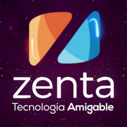

# Angular Essentials - TransBank EDITION

This edition of this extension is unique, it is designed to be used in specific developments of TransBank projects.

## 1.2.9 BlackCore

### Created

* The following extensions are included in this package:
  * Angular Language Service
  * PWA Tools
  * Angular Snippets
  * angular2-inline
  * Angular Schematics
  * Auto Complete Tag
  * rxjs-snippets
  * Typescript-Essentials:
    * TypeScript Hero
    * TypeScript Importer
    * Javascript-Essentials:
      * ESLint
      * npm Intellisense
      * Visual Studio IntelliCode
      * JavaScript (ES6) code snippets
      * Debugger for Firefox
      * Path Intellisense
      * Formatting Toggle
  * VSC-Essentials:
    * Markdown All in One
    * markdownlint
    * XML Tools
    * Rainbow CSV
    * SVG Previewer
    * Color Highlight
    * Todo Tree
    * Terminal in Status Bar
    * indent-rainbow
    * Better Comments
    * Bookmarks
    * Git Graph
    * GitLens — Git supercharged
    * Git History
    * gitignore
    * CodeSnap
    * :emojisense:
  * Material Icon Theme
  * Material Product Icons
  * Monokai Night Theme
  * SynthWave '84
  * Ubuntu Style Theme
