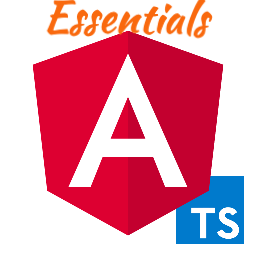

# Angular Essentials - Extension Pack for Visual Studio Code

[](https://www.transbankdevelopers.cl/)

This extension pack for Visual Studio Code adds extensions that are convenient and useful for any Angular development.

This **BlackCore** version of the extension pack is for a series of specific projects in TransBank that share the same technology stack transversally.

## Reasons

This extension pack was made to automate and standardize the setup phase of the development environment for Visual Studio Code, to have the same set of extensions, use the same id settings and file format everyone works on together.

See the [CHANGELOG](CHANGELOG.md) for the latest changes

## **settings.json**

It is imperative that the settings be added to settings.json, inside the ".vscode" folder, and that this file be inside Git version control for this extension pack to work correctly.

``` json
/**
 * * ZentaGroup's Essential Settings
 */
{
  // VSCode Settings
  "extensions.ignoreRecommendations": true,
  "editor.bracketPairColorization.enabled": true,
  "editor.bracketPairColorization.independentColorPoolPerBracketType": true,
  "editor.guides.bracketPairs": "active",
  "editor.guides.indentation": true,
  "editor.indentSize": 2,
  "editor.tabCompletion": "on",
  "editor.showDeprecated": true,
  "editor.codeActionsOnSave": {
    "source.organizeImports": "explicit",
    "source.fixAll.eslint": "explicit",
    "source.fixAll": "explicit"
  },
  "editor.rulers": [
    140
  ],
  "editor.formatOnSave": true,
  "eslint.enable": true,
  "eslint.format.enable": false,
  "eslint.codeAction.showDocumentation": {
    "enable": true
  },
  "eslint.codeAction.disableRuleComment": {
    "enable": true,
    "location": "separateLine",
    "commentStyle": "line"
  },
  // Code & Formatter Settings
  "[markdown]": {
    "editor.defaultFormatter": "yzhang.markdown-all-in-one"
  },
  "[json]": {
    "editor.defaultFormatter": "vscode.json-language-features"
  },
  "[jsonc]": {
    "editor.defaultFormatter": "vscode.json-language-features"
  },
  "[xml]": {
    "editor.defaultFormatter": "DotJoshJohnson.xml"
  },
  "[javascript]": {
    "editor.defaultFormatter": "vscode.typescript-language-features"
  },
  "[javascriptreact]": {
    "editor.defaultFormatter": "vscode.typescript-language-features"
  },
  "[typescript]": {
    "editor.defaultFormatter": "vscode.typescript-language-features"
  },
  "[typescriptreact]": {
    "editor.defaultFormatter": "vscode.typescript-language-features"
  },
  "[css]": {
    "editor.defaultFormatter": "vscode.css-language-features"
  },
  "[less]": {
    "editor.defaultFormatter": "vscode.css-language-features"
  },
  "[scss]": {
    "editor.defaultFormatter": "vscode.css-language-features"
  },
  "[html]": {
    "editor.defaultFormatter": "vscode.html-language-features"
  },
  "javascript.format.enable": true,
  "javascript.format.semicolons": "insert",
  "javascript.preferences.quoteStyle": "single",
  "typescript.format.enable": true,
  "typescript.format.semicolons": "insert",
  "typescript.preferences.quoteStyle": "single",
  "css.hover.documentation": true,
  "css.lint.important": "warning",
  "less.hover.documentation": true,
  "less.lint.important": "warning",
  "scss.hover.documentation": true,
  "scss.lint.important": "warning",
  "html.hover.documentation": true,
  "markdownlint.config": {
    "default": true,
    "MD001": false,
    "MD010": false,
    "MD024": false,
    "MD025": false
  },
  // Extensions Settings
  "todo-tree.tree.showCountsInTree": true,
  "todo-tree.general.statusBar": "top three",
  "todo-tree.general.showIconsInsteadOfTagsInStatusBar": true,
  "todo-tree.general.tags": [
    "TODO",
    "FIXME",
    "FIXIT",
    "FIX",
    "BUG",
    "HACK",
    "UNDONE",
  ],
  "todo-tree.general.tagGroups": {
    "FIXME": [
      "FIXME",
      "FIXIT",
      "FIX",
      "BUG",
    ]
  },
  "todo-tree.highlights.customHighlight": {
    "TODO": {
      "gutterIcon": true,
      "icon": "tasklist",
      "iconColour": "#FF9E29",
      "type": "tag",
      "background": "#CF7200",
      "foreground": "#FFFFFF",
      "fontWeight": "bold"
    },
    "FIXME": {
      "gutterIcon": true,
      "icon": "tools",
      "iconColour": "#00BD00",
      "type": "tag",
      "background": "#008000",
      "foreground": "#ffffff",
      "fontWeight": "bold"
    },
    "UNDONE": {
      "gutterIcon": true,
      "icon": "history",
      "iconColour": "#FFFF00",
      "type": "tag",
      "background": "#FFFF00",
      "foreground": "#141D1E",
      "fontWeight": "bold"
    },
    "HACK": {
      "gutterIcon": true,
      "icon": "code",
      "iconColour": "#FF30C8",
      "type": "tag",
      "background": "#141D1E",
      "foreground": "#fa64d2",
      "fontWeight": "bold"
    }
  },
  "better-comments.multilineComments": true,
  "better-comments.tags": [
    {
      "tag": "!",
      "color": "#FF2D00",
      "strikethrough": false,
      "underline": false,
      "backgroundColor": "transparent",
      "bold": true,
      "italic": false
    },
    {
      "tag": "?",
      "color": "#3498DB",
      "strikethrough": false,
      "underline": false,
      "backgroundColor": "transparent",
      "bold": false,
      "italic": false
    },
    {
      "tag": "//",
      "color": "#474747",
      "strikethrough": true,
      "underline": false,
      "backgroundColor": "transparent",
      "bold": false,
      "italic": false
    },
    {
      "tag": "todo",
      "color": "#FF8C00",
      "strikethrough": false,
      "underline": false,
      "backgroundColor": "transparent",
      "bold": false,
      "italic": false
    },
    {
      "tag": "fixme",
      "color": "#008000",
      "strikethrough": false,
      "underline": false,
      "backgroundColor": "transparent",
      "bold": false,
      "italic": false
    },
    {
      "tag": "fixit",
      "color": "#008000",
      "strikethrough": false,
      "underline": false,
      "backgroundColor": "transparent",
      "bold": false,
      "italic": false
    },
    {
      "tag": "fix",
      "color": "#008000",
      "strikethrough": false,
      "underline": false,
      "backgroundColor": "transparent",
      "bold": false,
      "italic": false
    },
    {
      "tag": "bug",
      "color": "#008000",
      "strikethrough": false,
      "underline": false,
      "backgroundColor": "transparent",
      "bold": false,
      "italic": false
    },
    {
      "tag": "*",
      "color": "#98C379",
      "strikethrough": false,
      "underline": false,
      "backgroundColor": "transparent",
      "bold": true,
      "italic": false
    }
  ],
  "gitlens.statusBar.enabled": true,
  "gitlens.blame.avatars": true,
  "gitlens.hovers.avatars": true,
  "gitlens.hovers.avatarSize": 64,
  "gitlens.hovers.changesDiff": "hunk",
  "material-icon-theme.folders.theme": "specific",
  "material-icon-theme.folders.associations": {
    "directives": "Prisma",
    "interceptors": "Routes",
    "xml": "Views",
    "background": "Images",
    "favicon": "Images",
    "png": "Images",
    "jpeg": "Images",
    "jpg": "Images",
  },
  "material-icon-theme.files.associations": {
    "*.provider.ts": "Angular-service"
  },
  "svg.preview.autoOpen": true,
  "svg.preview.transparencyGrid": true,
  "svg.preview.boundingBox": true
}
/**
 * * ZentaGroup's Essential Settings
 */
```

## Included

This extension pack includes the following extensions:

* The following extensions are included in this package:
  * Angular Language Service
  * PWA Tools
  * Angular Snippets
  * angular2-inline
  * Angular Schematics
  * Auto Complete Tag
  * rxjs-snippets
  * Typescript-Essentials:
    * TypeScript Hero
    * TypeScript Importer
    * Javascript-Essentials:
      * ESLint
      * npm Intellisense
      * Visual Studio IntelliCode
      * JavaScript (ES6) code snippets
      * Debugger for Firefox
      * Path Intellisense
      * Formatting Toggle
  * VSC-Essentials:
    * Markdown All in One
    * markdownlint
    * XML Tools
    * Rainbow CSV
    * SVG Previewer
    * Color Highlight
    * Todo Tree
    * Terminal in Status Bar
    * indent-rainbow
    * Better Comments
    * Bookmarks
    * Git Graph
    * GitLens — Git supercharged
    * Git History
    * gitignore
    * CodeSnap
    * :emojisense:
  * Material Icon Theme
  * Material Product Icons
  * Monokai Night Theme
  * SynthWave '84
  * Ubuntu Style Theme

[](https://zentagroup.com/)
